# 🚚 Awesome Last-Mile Delivery Platform 📦

  
  
  
  
  
  

## 🌐 Top Last-Mile Delivery & Route Optimization Platforms Ecosystem

**A curated list of enterprise SaaS products, route optimization engines, driver apps, real-time fleet tracking software, proof of delivery (POD) tools, and open-source logistics frameworks.**

*Last updated: September 2026*

---

### 🗺️ Overview & Market Intelligence

This repository tracks top-tier **SaaS platforms** and **open-source projects** designed for **Last-Mile Delivery Operations**. These solutions empower logistics providers, courier services, e-commerce brands, quick-commerce operators, and field service teams to automate order dispatch, optimize vehicle routing (VRP), track drivers live, issue automated ETA notifications, and collect digital proof of delivery.

> 📊 **Market Size & Structure**: The global last-mile delivery market size is estimated at **$165+ Billion in 2026** (projected to exceed $250 Billion by 2030 at ~10% CAGR). The SaaS & logistics software sector is **moderately fragmented**, with regional market leaders (e.g., Bringg, Onfleet, FarEye) and high specialization across courier, grocery, retail, and 3PL market segments rather than a single winner-take-all monopoly.

---

## 📑 Table of Contents
- [🏢 SaaS & Commercial Platforms](#-saas--commercial-platforms)
- [💻 Open-Source GitHub Projects](#-open-source-github-projects)
- [🛠️ Key Open-Source Building Blocks](#️-key-open-source-building-blocks)
- [🤝 How to Contribute](#-how-to-contribute)
- [💖 Support & Sponsorship](#-support--sponsorship)
- [⚠️ Disclaimer](#️-disclaimer)
- [📈 Star History](#-star-history)

---

## 🏢 SaaS & Commercial Platforms

The table below lists leading commercial last-mile delivery software, ranked by company scale (estimated valuation / market funding / annual revenue).

| Platform | Description | Est. Valuation / Revenue Scale | Starting Pricing | Free Tier / Trial Limit |
| :--- | :--- | :--- | :--- | :--- |
| **[Bringg](https://www.bringg.com/)** 🚀 | Enterprise delivery orchestration platform for coordinating internal fleets, 3PLs, and retail delivery networks. | **Valuation: ~$1.0 Billion+** (Unicorn scale; $200M+ funding) | ~$1,000 / month (Enterprise customized tiers) | No permanent free tier. 14-day enterprise demo/trial upon request. |
| **[FarEye](https://www.fareye.com/)** 👁️ | AI-powered last-mile logistics management platform emphasizing real-time visibility, predictive ETAs, and carrier allocation. | **Valuation: ~$400 Million+** ($100M+ total funding, $50M+ ARR scale) | ~$500 / month (Customized per order/driver tier) | No permanent free tier. 14-day trial available upon sales contact. |
| **[LogiNext](https://www.loginextsolutions.com/)** 📊 | Enterprise logistics & delivery automation platform covering last-mile, linehaul, and field workforce management. | **Valuation: ~$150 Million - $200 Million** ($50M+ funding) | ~$499 / month (Enterprise tiering) | No permanent free tier. 14-day free trial for registered business users. |
| **[Onfleet](https://onfleet.com/)** 🚚 | Mid-market and enterprise delivery management platform with polished dispatcher dashboard, driver apps, live tracking, and SMS notifications. | **Valuation: ~$150 Million - $200 Million** ($40M+ funding) | **$550 / month** (Launch Plan, includes 2,000 pickups/deliveries) | No permanent free tier. **14-day full feature free trial** (no credit card required). |
| **[DispatchTrack](https://www.dispatchtrack.com/)** 📍 | High-volume last-mile delivery scheduling, customer experience, and proof-of-delivery platform for big & bulky / 3PL logistics. | **Valuation: ~$150 Million+** ($144M+ growth funding) | ~$450 / month (Volume-based enterprise tier) | No permanent free tier. 14-day custom demo / trial on request. |
| **[Routific](https://www.routific.com/)** 🛣️ | Intelligent route optimization and delivery management tool built for small-to-medium delivery fleets and couriers. | **Revenue: ~$10 Million - $25 Million ARR** (Bootstrapped/Scaleup) | **$49 / driver / month** (Essentials Plan) | No permanent free tier. **7-day full feature free trial**. |
| **[Circuit](https://team.circuit.com/)** ⚡ | Driver-first route planning and multi-stop dispatch app for delivery drivers, couriers, and small team management. | **Revenue: ~$15 Million - $30 Million ARR** | **$100 / month** (Circuit for Teams Starter, up to 130 stops/plan) | No permanent free tier. **14-day free trial** for Circuit for Teams. |
| **[Track-POD](https://www.track-pod.com/)** 📝 | Paperless delivery management software with route planning, driver app, digital signature POD, and customer tracking. | **Revenue: ~$5 Million - $15 Million ARR** | **$29 / driver / month** (Standard Plan) | No permanent free tier. **7-day free trial** (up to 2 drivers). |
| **[OptimoRoute](https://optimoroute.com/)** 🎯 | Multi-stop route optimization and scheduling software with multi-day planning, driver workload balancing, and return-to-depot support. | **Revenue: ~$5 Million - $15 Million ARR** | **$39.10 / driver / month** (Lite Plan, billed annually) | No permanent free tier. **30-day full feature free trial**. |
| **[Tookan](https://tookan.app/)** 📦 | On-demand delivery management suite by JungleWorks with automated dispatch, agent tracking, and marketplace integrations. | **Revenue: ~$5 Million - $10 Million ARR** | **$29 / month** (Early Stage Plan, includes 200 tasks/month) | No permanent free tier. **14-day free trial**. |
| **[Upper](https://www.upperinc.com/)** 📍 | Algorithmic route planning and last-mile optimization platform designed for local delivery businesses and urgent couriers. | **Revenue: ~$2 Million - $5 Million ARR** | **$80 / month** (Includes up to 3 drivers) | No permanent free tier. **7-day free trial**. |
| **[Elite EXTRA](https://www.eliteextra.com/)** 🚛 | Advanced dispatch and routing software for wholesale distributors, auto parts delivery, and retail 3PL fleets. | **Revenue: ~$10 Million - $20 Million ARR** | ~$350 / month (Base dispatch tier) | No permanent free tier. 14-day interactive demo / trial on request. |
| **[Shipsy](https://shipsy.io/)** 🚢 | End-to-end logistics orchestration platform managing cross-border, express logistics, and last-mile delivery operations. | **Valuation: ~$50 Million - $100 Million** ($60M+ funding) | ~$300 / month (Custom operational tier) | No permanent free tier. 14-day trial upon enterprise contact. |
| **[Stuart](https://stuart.com/)** 🚲 | On-demand urban last-mile delivery platform connecting enterprise merchants with instant tech-enabled courier fleets. | **Revenue: ~$100 Million+ ARR** (Acquired by GeoPost / DPDgroup) | **€9.50 / delivery** (On-demand pay-per-job tier) | No permanent free tier. Pay-as-you-go per API request / delivery job. |

---

## 💻 Open-Source GitHub Projects

Below is a list of top open-source vehicle routing engines, dispatch hubs, and logistics building blocks sorted by GitHub star count.

*    **[Google OR-Tools](https://github.com/google/or-tools)**  
    Fast and portable software suite for solving vehicle routing problems (VRP, TSP, VRPTW), linear programming, and constraint optimization across Python, C++, Java, and C#.

*    **[GraphHopper](https://github.com/graphhopper/graphhopper)**  
    Fast and memory-efficient OpenStreetMap-based routing engine written in Java. Computes matrix distances, travel times, and turn-by-turn navigation for delivery fleets.

*    **[Fleetbase](https://github.com/fleetbase/fleetbase)**  
    Modular open-source logistics and fleet operations platform. Provides real-time driver tracking, order dispatch API, customer notifications, and mobile app consoles.

*    **[VROOM](https://github.com/VROOM-Project/vroom)**  
    High-performance open-source vehicle routing engine in C++ designed to solve Capacitated Vehicle Routing Problems (CVRP), pickup-and-delivery, and time-window constraints.

*    **[Apache Baremaps](https://github.com/apache/incubator-baremaps)**  
    Open-source toolkit and vector tile pipeline for building custom map servers, spatial routing graphs, and location workflows for delivery tracking.

*    **[pgRouting](https://github.com/pgRouting/pgrouting)**  
    PostGIS extension adding geospatial routing functionality (Dijkstra, A*, TSP, VRP) directly within PostgreSQL databases.

*    **[OpenVRP](https://github.com/Open-Vehicle-Routing-Problem/openvrp)**  
    Open-source solver suite and benchmarking tool dedicated to complex vehicle routing and last-mile dispatch algorithms.

*    **[Last Mile Route Optimizer](https://github.com/robrichardson/last-mile-routing)**  
    Python-based last-mile routing framework combining OpenStreetMap data, distance matrix generators, and heuristic VRP solvers.

*    **[Courier & Delivery Proof-of-Delivery Helper](https://github.com/delivery-stack/driver-app-demo)**  
    Open-source React Native and Flutter starter components for capturing driver signatures, photo POD, and barcode scans.

---

## 🛠️ Key Open-Source Building Blocks

When building a custom self-hosted last-mile delivery platform, developers combine the following components:

1. 📥 **Order Ingestion & Dispatch Core**: Modern REST/GraphQL APIs (e.g., [Fleetbase](https://github.com/fleetbase/fleetbase)) to handle order status updates and driver assignments.
2. 🗺️ **Road Network & Matrix Calculation**: [GraphHopper](https://github.com/graphhopper/graphhopper) or OSRM running on OpenStreetMap vector data.
3. 🧮 **Route Optimization Engine**: [VROOM](https://github.com/VROOM-Project/vroom) or [Google OR-Tools](https://github.com/google/or-tools) for solving vehicle routing with time windows (VRPTW) and capacity constraints.
4. 📱 **Driver App & Real-Time GPS Tracking**: Mobile SDKs sending coordinates back to WebSocket / MQTT brokers.
5. ✍️ **Proof of Delivery (POD)**: Digital signature capture, barcode scanning, and photographic verification.

---

## 🤝 How to Contribute

Contributions are highly welcome! Please follow these simple steps:

1. Fork this repository.
2. Add or update entries in `README.md` maintaining table/markdown formatting.
3. Include: project name, official website/repo link, key capabilities, and starting pricing/star count.
4. Submit a Pull Request with a clear summary of changes.

---

## 💖 Support & Sponsorship

Thank you for exploring and using this last-mile delivery curated guide! If you find this resource helpful for your logistics research, engineering projects, or software architecture decisions:

- ⭐ **Star** this repository to show your support!
- 🔀 **Fork** and share it with fellow developers and logistics professionals.
- ☕ **Buy me a coffee**: Support ongoing maintenance and curated open-source projects via the [GitHub Sponsor Dashboard](https://github.com/sponsors/ishandutta2007).

  

---

## ⚠️ Disclaimer

- This list is **community-curated** for educational and architectural research purposes.
- Last-mile software handles driver location data, customer PII, and route metrics. Ensure full compliance with regional privacy laws (GDPR, CCPA) and mapping provider licenses when deploying self-hosted solutions.

---

## 📈 Star History

---

  <b>Made for logistics managers, courier operators, and developers building delivery systems.</b>

